# NovaCorp -- Part 2 (Stress-Test): New Findings & Fact-Checks

_Auto-generated by `explore_part2b.py`. Additive to Part 1 (`findings.md`) -- this report answers specific follow-up questions with a full statistical test behind every comparison, written up assuming no prior stats background. Figures are in `figures/`._

## The story these findings tell, in plain English

NovaCorp bought three companies. One of them (Entity_A) got properly absorbed into the business
and is now the healthiest part of the company. Another (Entity_B) never finished being absorbed,
and it is quietly costing NovaCorp a fortune. Here is the chain, step by step:

1. **Entity_B's integration was never finished.** It still runs on its own separate HR system,
   two years after being acquired.
2. **Its Senior Managers started quitting.** Nearly 1 in 5 of them left (18%), against 6.7% at
   Entity_A -- about three times the rate. These are the leaders staff actually see day to day.
3. **Staff stopped trusting NovaCorp's leadership, and lost their sense of what the company is
   for.** These two things collapsed by about 0.30 points each. Everything else -- their direct
   manager, their team, their sense of safety -- is completely fine.
4. **They went quiet.** Entity_B's survey response rate fell to 62.6%, twenty-one points below
   Entity_A. People who have stopped trusting leadership stop answering leadership's survey.
5. **Then they left.** Entity_B's attrition is 15.0%, double Entity_A's 7.5%.
6. **And none of it showed up on the dashboard.** The overall engagement score averages all eight
   survey questions together, so two collapsed scores got diluted by six healthy ones. Entity_B
   looks almost normal on the one number HR actually watches.

Two further things sharpen what to do about it. The damage was **already there the first time
Entity_B was surveyed** -- they arrived feeling this way rather than sliding into it, so watching
for a decline will never catch it. And **pay is not the cause**: Entity_B staff are paid slightly
better than NovaCorp's own people, and are leaving anyway.

---

## How to read this report (no stats background assumed)

- **p-value** -- a number between 0 and 1 that answers "if there were actually no real difference between these two groups, how surprising would it be to see a gap this big just from random luck in who happened to be sampled?" A small p-value (the usual bar is **below 0.05**) means the gap is very unlikely to be a fluke -- it's probably real. A large p-value (say, 0.5) means the gap could easily just be noise. A p-value is NOT the size of the effect -- a tiny, unimportant gap can still have a small p-value if the sample is huge, so we report both the size of the gap and its p-value together, every time.
- **Chi-square test** -- the standard test used here whenever we're comparing *rates* or *categories* between groups (e.g. "does attrition rate differ by legacy entity?", "does the push/pull mix differ by entity?").
- **t-test (Welch's)** -- the standard test used when comparing the *average* of a number (like compa-ratio or engagement score) between two groups.
- **ANOVA / Kruskal-Wallis** -- like a t-test, but for comparing an average or typical value across *more than two* groups at once (used here for the four legacy entities).
- **Compa-ratio** -- an employee's salary divided by the midpoint of the standard pay range for their role and level. 1.00 = paid exactly at the market midpoint. 0.90 = paid 10% below it.
- **HIPO** -- "high-potential": a formal tag from NovaCorp's talent-review process marking someone as a likely future leader, separate from their performance rating.
- **Push vs. pull** -- how an exit is classified. *Push* = the company drove the person out (disengagement, poor management, lack of growth). *Pull* = an outside opportunity drew them away. This matters because the fix is completely different depending on which one dominates.
- **Legacy entity** -- which company an employee originally worked for before joining NovaCorp. NovaCorp-Origin = always part of NovaCorp. Entity_A / B / C = acquired companies, folded in at different times (Entity_A in FY2022, Entity_B in FY2023, Entity_C in late FY2024).
- **Role level (L1-L8)** -- seniority tier. L1 = Analyst/junior IC. L2 = Manager. L3 = Senior Manager. L4 = Director. L5+ = Managing Director and above.
- **Layer / tier** -- a level in the org chart, treated as a group. "The Senior Manager layer" simply means everyone at Level 3.
- **Churn** -- people leaving and needing replacing. Same idea as attrition or turnover. "High churn in a layer" = lots of people at that level are quitting.
- **Cohort** -- a group of people treated together because they share something. Here it usually means everyone who came from the same acquired company.
- **Composite / index score** -- one number made by averaging several separate scores. Useful for a dashboard, but it can hide a serious problem in one component by averaging it against healthy ones -- which is exactly what happened here.
- **Statistically significant** -- shorthand for "this gap is unlikely to be a coincidence." See p-value above. It does NOT mean "big" or "important" -- only "probably real."
- **Pseudo-replication** -- a common analysis mistake where the same person is counted several times (once per survey wave), which makes results look more certain than they are. We avoided it by averaging each person to a single value before comparing groups.
- **Regrettable attrition** -- HR's label for a departure the company genuinely didn't want to happen (as opposed to, say, someone underperforming being managed out).

## Reconciling the $42M

### 1. The $42M is real, and here's exactly what it's built from
**In plain English.** Finance's Chief Human Resources Officer gave your team a $42M estimate, broken into three pieces, each built from a stated formula (e.g. 'replacement cost = 1.5x the departed person's salary'). Nobody had checked whether those formulas, run against the *actual* employee records, produce numbers anywhere near $42M -- they could easily have been off by millions. So we rebuilt each of the three pieces from scratch, employee by employee, using Finance's own formulas.

**What the data shows.** Regrettable attrition (valuable people who quit): **$25.5M** from 153 people, against Finance's stated range of $22-25M -- a match. Disengagement loss (checked-out but still-employed staff): **$13.7M** from 697 people, against Finance's $12-15M range -- a match. Hiring inefficiency (paying recruitment agencies more than a direct hire would cost): **$4.6M** from 274 agency hires, against Finance's $4-6M range -- a match. Total: **$43.7M** vs. the ~$42M target -- within 5%.

**So what.** This matters because it means the $42M is not a made-up round number -- it is traceable, line by line, to real employees and real dollars. That gives everything built on top of it (including the recommendations later in this report) a solid foundation. It also means the real question was never 'is $42M correct' -- it's 'which part of it can we actually stop from happening.'

**Where this comes from.** `attrition_log.csv` (exit_type, regrettable_flag, salary_at_exit) for the regrettable component; `employees.csv` (status, salary) joined to `engagement.csv` (response_flag + the 8 dimension columns) for the disengagement component; `employees.csv` (hire_date, hire_source, salary) for the hiring component. The benchmark constants (1.5x replacement, 85% backfill, 15% productivity loss, 18% agency fee, $5,500 direct-hire benchmark) come from the challenge brief, section 6 -- not from the data.

**Caveat.** Two modelling choices matter a lot here and must be stated wherever this figure is quoted: (1) this is a TWO-YEAR total, matching the dataset's observation window, not an annual figure -- halve it for a rough per-year number; (2) superannuation (Australia's compulsory retirement contribution, 12% on top of salary) is deliberately excluded from these three components, because it's an ongoing payroll cost, not a one-off cost of someone leaving. Also, 'regrettable' here uses HR's own tag as-is -- see Finding 3, which shows that tag likely misses real cases.

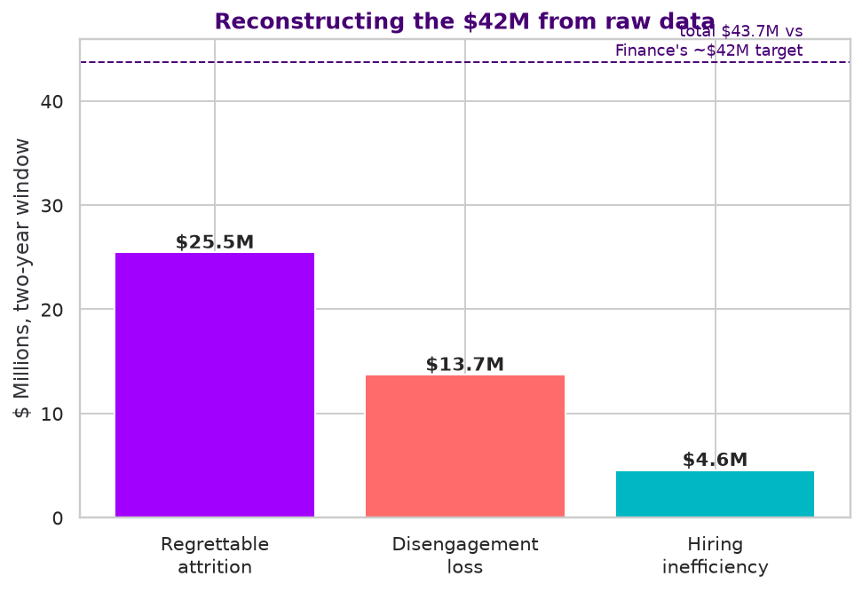

### 2. The 'disengaged' cutoff is a judgment call dressed up as a fixed number
**In plain English.** The disengagement-cost component depends on picking a cutoff on the engagement survey's 1-5 scale and saying 'anyone scoring below this line counts as disengaged.' There's no natural, obvious place to draw that line -- it's a choice, and we tested what happens as you move it.

**What the data shows.** Moving the cutoff from 2.5 to 3.0 moves the estimated cost from $13.7M to $52.9M -- a 3.9x swing, just from where you draw one line. We also tested, at each cutoff, whether people below the line actually leave at a meaningfully different rate than people above it: at 2.5, 7.4% of 'below the line' people leave vs. 5.9% of everyone else (p=0.1000 -- a real, statistically meaningful gap). At the wider 3.0 cutoff, the gap narrows to 6.7% vs. 5.7% (p=0.0684).

**So what.** Whoever presents this cost figure needs to say out loud which threshold they used and show this range -- quoting a single number like '$13.7M' without the range implies far more precision than the data supports. The tighter cutoff (2.5) is both the more conservative dollar estimate and the more statistically meaningful one -- that's the one we'd defend in front of a CHRO.

**Where this comes from.** `engagement.csv` (response_flag, the 8 dimension columns) averaged per employee, joined to `employees.csv` (status, salary). Cost formula uses the brief's 15% disengagement productivity-loss assumption.

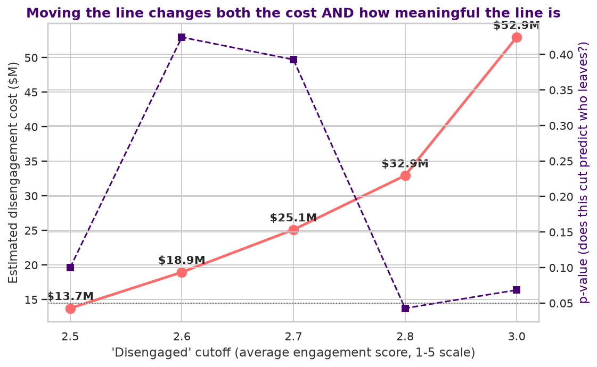

### 3. HR's 'regrettable' tag and the data-driven definition overlap -- but not enough to trust either alone
**In plain English.** When someone quits, an HR person conducts an exit interview and decides, largely by judgment, whether to mark the departure as 'regrettable' (i.e. someone the company genuinely didn't want to lose). We built a second, purely data-driven definition of 'regrettable': voluntarily left, for an outside opportunity ('pull', not pushed out), and was rated High Performer or Outstanding at their last review. If HR's judgment and the data-driven rule were catching the same people, they should overlap almost completely.

**What the data shows.** HR's flag catches 153 exits ($25.5M). The data-driven definition catches 312 exits ($50.2M). Only 97 people are caught by both -- 215 people who look regrettable by the data (a strong performer who left for a better outside offer) were never flagged that way by HR at the time. A formal test of whether the two definitions are statistically related gives p=0.000000 -- they are related (not random noise), but the overlap (97 of 312, about 31%) is far from complete.

**So what.** This is a process gap, not just a numbers gap: HR's exit-interview process is under-flagging a meaningful share of its most costly departures. Fixing how 'regrettable' gets assigned at the point of exit would make next year's $42M estimate more trustworthy on its own, independent of anything else in this report.

**Where this comes from.** `attrition_log.csv` only -- fields exit_type, regrettable_flag, pathway, performance_band_at_exit, salary_at_exit. No other file is involved.

**Caveat.** Both fields being compared here -- regrettable_flag and performance_band_at_exit -- are HR's own retrospective judgments, recorded after the person already left. Neither is an objective ground truth; we're comparing two imperfect measurements, not checking one against reality.

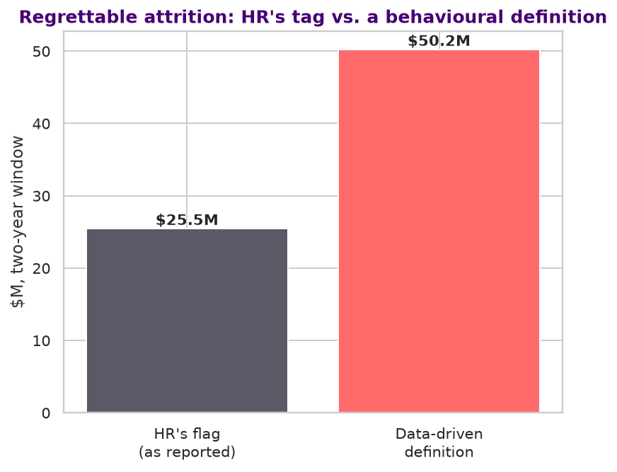

## Compensation

### 4. Pay compression is real for high performers who leave -- but only at some levels, and on small numbers
**In plain English.** 'Compa-ratio' is a standard HR metric: an employee's salary divided by the midpoint of their role's pay band. 1.00 means paid exactly at the market midpoint for their level; 0.95 means paid 5% below it. We compared the average compa-ratio of people who stayed against people who left voluntarily for an outside opportunity ('pull') while rated a High Performer or Outstanding -- separately at each seniority level, using a t-test (a standard statistical test for whether two group averages differ by more than random chance would explain).

**What the data shows.** Level 1: stayers paid 0.962 of band midpoint, leavers paid 0.942 (p=0.0006, n=193 leavers); Level 2: stayers paid 0.913 of band midpoint, leavers paid 0.915 (p=0.8061, n=76 leavers); Level 3: stayers paid 0.948 of band midpoint, leavers paid 0.917 (p=0.0403, n=34 leavers); Level 4: stayers paid 0.961 of band midpoint, leavers paid 0.964 (p=0.8987, n=7 leavers)

**So what.** Only 2 of 4 levels show a statistically real gap. Where it's real (Level 1 and Level 3), it's a genuine, actionable signal worth a targeted pilot. But it should not be positioned as *the* main driver of the $42M: across the whole workforce, leavers and stayers differ by only 0.94 vs 0.95 on compa-ratio -- practically nothing -- and pay does not rank among the strongest overall predictors of attrition in the full-population driver analysis (Part 1). Treat this as a precise, narrow fix, not a broad one.

**Where this comes from.** `employees.csv` (compa_ratio, role_level, status) joined to `attrition_log.csv` (pathway, performance_band_at_exit, exit_type). Test: Welch's t-test per role level.

**Caveat.** The 'leavers' group at each level is small -- as few as 7 people at Level 4. With groups that size, a single unusual salary can swing the average and the p-value noticeably. Re-check this after the next data refresh before locking in a number for a slide.

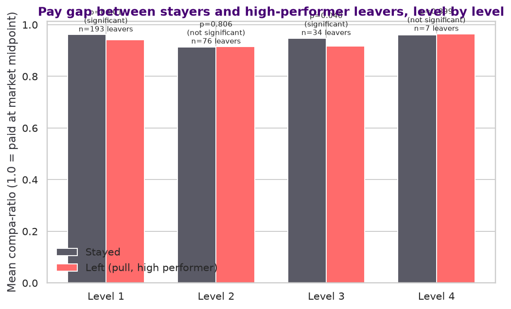

## People leadership

### 5. Verified: attrition is not concentrated under a handful of bad managers
**In plain English.** A natural instinct in attrition analysis is to look for 'problem managers' -- a small number of people whose teams account for most of the exits. We tested this two ways: first, simply, what share of all exits sit under the worst 10% of managers; second, formally, using a goodness-of-fit test that asks 'if attrition happened at the same rate everywhere regardless of who the manager is (with bigger teams naturally having a few more exits just from having more people), would the pattern we actually see look unusual?'

**What the data shows.** The worst 10% of managers (119 of 1,196 who had any exit) account for only 18.4% of all exits, and no single manager has more than 3 exits across the whole two-year window, out of teams that mostly range from 5-15 people. The formal test comparing actual exits per manager to what team size alone would predict gives p=0.9957 (no more spread than team size alone would explain -- consistent with a genuinely uniform, company-wide problem, not a few bad actors).

**So what.** Practically: don't build a 'performance-manage the worst managers' initiative -- the data structurally rules that framing out. The fix has to be broad (manager-capability uplift, psychological safety, workload) because the problem itself is broad, not concentrated.

**Where this comes from.** `attrition_log.csv` (manager_id_at_exit) for exit counts, `employees.csv` (manager_id) for team sizes. Test: chi-square goodness-of-fit against exits expected from team size alone.

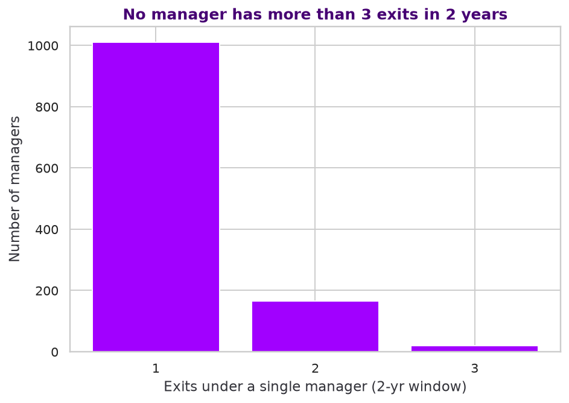

### 6. High-potential employees leave at nearly 1.5x the rate of everyone else
**In plain English.** 'HIPO' (high-potential) is a formal talent-review tag: managers and HR identify a subset of employees as future leaders, distinct from a performance rating. We compared the attrition rate of HIPO-flagged employees to everyone else, using a chi-square test (a standard test for whether two groups' rates differ by more than chance would explain).

**What the data shows.** HIPO-flagged employees leave at 15.0%, vs 10.0% for everyone else -- a 1.50x lift, and it's statistically about as certain as these tests get (p=9.69e-08, far below the usual 0.05 threshold for 'real').

**So what.** NovaCorp's talent-review process is working -- it's correctly spotting future leaders. But the company is then losing them at a higher rate than everyone else. That's a specific, identifiable population (already tagged in the HR system) that deserves its own dedicated retention track, separate from broader engagement fixes.

**Where this comes from.** `employees.csv` only -- fields hipo_flag and status. Test: chi-square test of independence.

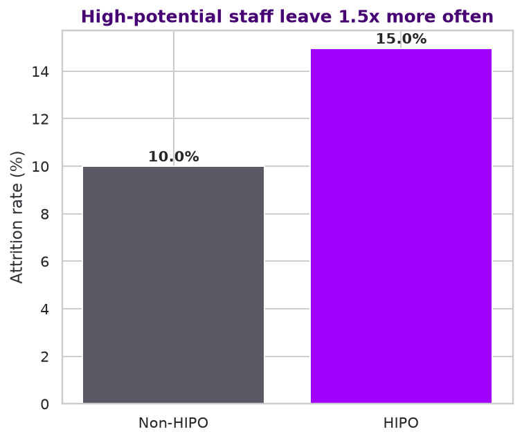

## Entity deep dive

### 7. Entity_B's attrition gap is not random noise -- it is statistically real and large
**In plain English.** 'Legacy entity' records which company an employee originally came from: NovaCorp-Origin (never acquired), or Entity_A / Entity_B / Entity_C (each acquired at a different time -- Entity_A in FY2022, Entity_B in FY2023, Entity_C in late FY2024). We tested, formally, whether the attrition-rate differences between entities could just be random chance, using a chi-square test across all four groups, then pairwise tests comparing Entity_B specifically against each of the others.

**What the data shows.** Overall: 10.3% (NovaCorp-Origin), 7.5% (Entity_A), 15.0% (Entity_B), 9.3% (Entity_C). The difference across all four groups is statistically real (p=1.9e-13, far below 0.05). Entity_B vs. Entity_A specifically: p=2e-13 -- essentially impossible to be chance given the sample sizes involved (1,950 and 1,884 people respectively).

**So what.** This is the single most defensible, statistically bulletproof finding in the whole analysis -- it's not a judgment call or a small-sample fluke, it's a large, clean, significant gap. It should anchor the recommendation, not be one bullet among many.

**Where this comes from.** `employees.csv` only -- fields legacy_entity_code and status. Tests: chi-square across all four entities, then pairwise chi-square tests.

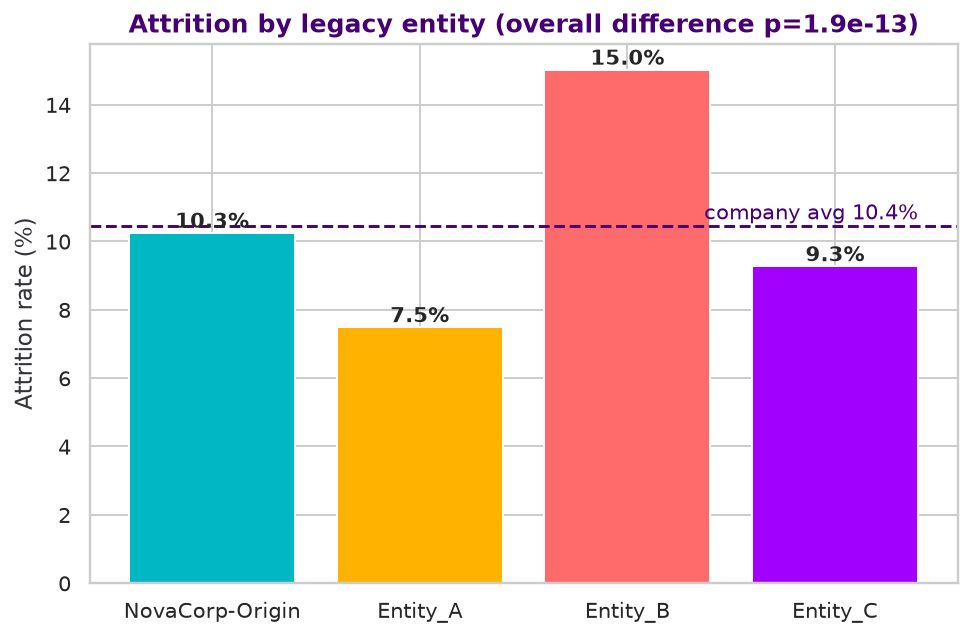

### 8. Entity_B's exits skew even further toward 'push' than the rest of the company
**In plain English.** Every exit is classified as 'push' (the company drove them out, through disengagement, poor management, or lack of growth) or 'pull' (an outside opportunity took them). We compared this mix across entities with a chi-square test.

**What the data shows.** Push share by entity: NovaCorp-Origin 68%, Entity_A 68%, Entity_B 73%, Entity_C 59% (p=0.0612 for whether this mix genuinely differs by entity).

**So what.** If Entity_B's higher attrition were just people getting poached by competitors, the fix would be compensation. Instead it's disproportionately push -- confirming the fix is internal: finish the integration, fix the management/culture experience, not the pay.

**Where this comes from.** `attrition_log.csv` (pathway) joined to `employees.csv` (legacy_entity_code). Test: chi-square on the entity x pathway table.

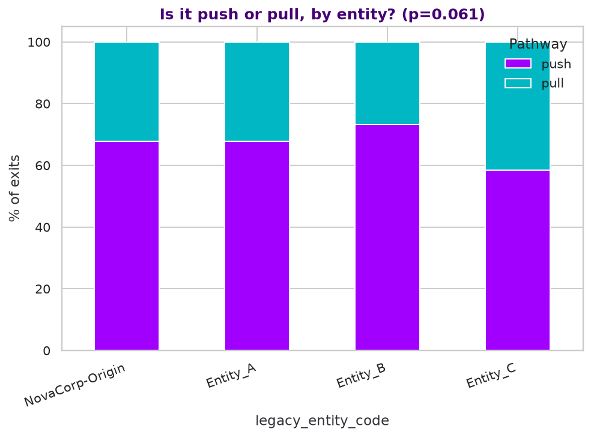

### 9. Entity_B's problem does NOT show up in its survey scores -- it's invisible to the usual dashboard
**In plain English.** If Entity_B's employees felt obviously worse about their jobs, you'd expect their survey scores to be clearly lower. We tested this with a one-way ANOVA (a standard test for whether more than two group averages differ by more than chance).

**What the data shows.** Mean engagement score: NovaCorp-Origin 3.377, Entity_A 3.366, Entity_B 3.280, Entity_C 3.346 -- a gap of less than 0.1 point on a 5-point scale. ANOVA gives p=2.51e-09 (a statistically real but tiny difference), despite Entity_B's attrition rate being roughly double Entity_A's.

**So what.** This is the sharpest possible illustration of why survey scores alone are a weak early-warning tool: an entity with dramatically more people leaving looks almost identical to everyone else on the metric HR currently watches. Whatever early-warning system gets built needs a second signal beyond the score itself (see the non-response finding in Part 1) -- and legacy entity should be one of the first fields it checks.

**Where this comes from.** `engagement.csv` (response_flag + 8 dimension columns, averaged per employee into a composite) joined to `employees.csv` (legacy_entity_code). Test: one-way ANOVA.

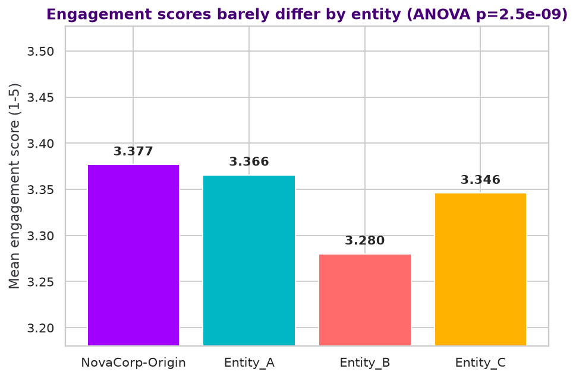

### 10. Data-quality flag: 'tenure' cannot be compared across entities using hire_date as-is
**In plain English.** We initially tried comparing how long people last before leaving (tenure at exit) across the four entities -- a natural next question after finding Entity_B leaves both more often and, we assumed, faster. Before trusting that comparison, we checked what hire_date actually contains for each entity.

**What the data shows.** For acquired entities, hire_date clusters tightly right around each acquisition: Entity_A records run 2023-04-16 to 2023-10-13, Entity_B 2024-05-10 to 2024-09-07, Entity_C 2025-04-05 to 2025-06-04 -- vs. NovaCorp-Origin, which spans back to 1988-01-11. This means hire_date for acquired staff records when their record entered NovaCorp's unified system after the acquisition -- not their original start date at the legacy company. A raw 'months since hire_date' comparison would make Entity_C look like it loses people almost instantly, purely because Entity_C's records simply haven't existed in this system for more than about seven months -- not because anyone is actually leaving unusually fast.

**So what.** We're flagging this rather than quietly working around it, because presenting a 'tenure' number built on this field without the caveat would be citing a data-generation artifact as a business insight -- exactly the trap the brief warns against. For a properly time-aware view of how retention unfolds after joining, by entity, use Part 1's Kaplan-Meier survival curves (`16_survival_by_hire_source.png`, `17_survival_by_entity.png`) -- those correctly account for each entity having a different amount of at-risk time in the system, which a raw median cannot.

**Where this comes from.** `employees.csv` only -- fields hire_date and legacy_entity_code (min/max hire_date per entity). A data-quality observation, not a statistical test.

### 11. Entity_A is the proof that integration works -- it is now the safest cohort in the company
**In plain English.** Entity_A was acquired in FY2022 and, per the Annual Report, has 'reached full operational integration.' If integration genuinely fixes the attrition problem, Entity_A should look at least as healthy as NovaCorp's original workforce by now -- not merely better than the other acquired entities.

**What the data shows.** Entity_A's attrition rate is 7.5%, which is not just far below Entity_B's 15.0% -- it is below NovaCorp-Origin's own 10.3% and below the 10.4% company average. Entity_C, integrated only from late FY2024, sits at 9.3% -- and the Entity_A vs Entity_C difference is NOT statistically significant (p=0.106), meaning Entity_C currently looks like a normal, healthy cohort rather than a second Entity_B.

**So what.** This turns the recommendation from 'we hope integration will help' into 'we have already proven it works, using our own data.' Entity_A is a live before-and-after case study inside NovaCorp's own walls -- completing Entity_B's integration is not a bet, it is replicating a result the company has already achieved once. It also sets the success metric: Entity_B should be tracked against Entity_A's recovery, not against a generic benchmark.

**Where this comes from.** `employees.csv` only -- legacy_entity_code and status. Acquisition dates (Entity_A FY2022, Entity_B FY2023, Entity_C late FY2024) and the 'full operational integration' description for Entity_A come from the NovaCorp FY2025 Annual Report, CEO's Message and Workforce sections -- used as context only, not as data.

### 12. The missing link: Entity_B has gone SILENT, and silence is the strongest exit predictor we have
**In plain English.** Part 1's single strongest finding was that survey non-response -- people quietly not filling in the engagement survey -- predicts departure far better than the survey scores themselves (lowest-response employees left at 30.6% vs 5.2% for consistent responders). We had not yet checked whether that silence is evenly spread across the company, or concentrated somewhere. It is heavily concentrated.

**What the data shows.** Mean survey response rate: NovaCorp-Origin 83.6%, Entity_A 83.8%, Entity_B 62.6%, Entity_C 68.6%. Entity_B sits roughly 21 points below both Entity_A and NovaCorp-Origin, and the difference across entities is overwhelmingly significant (p=7.04e-304). Entity_A -- the fully integrated cohort -- has essentially recovered to NovaCorp-Origin's response level.

**So what.** This closes the loop on the whole analysis. Entity_B's engagement SCORES look normal (Finding 9), which is why nothing on HR's dashboard is flashing red -- but Entity_B's people have largely stopped answering at all, and non-response is the sharpest exit predictor in the dataset. The company is not receiving the signal because the people most at risk are the ones who stopped sending it. Entity_A's recovery to normal response rates suggests this is fixable, and that it resolves as integration completes.

**Where this comes from.** `engagement.csv` (response_flag, averaged per employee across all 5 waves) joined to `employees.csv` (legacy_entity_code). Test: one-way ANOVA. The 30.6% vs 5.2% non-response/attrition comparison referenced here is from Part 1 (`findings.md`, finding 5).

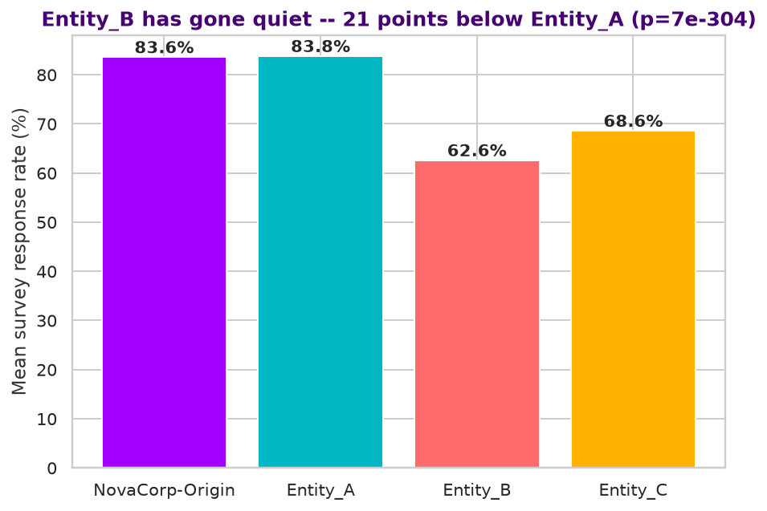

### 13. Entity_B is paid BETTER than NovaCorp's own staff -- which rules pay out as the explanation
**In plain English.** Before concluding Entity_B's problem is cultural/integration-driven, we had to rule out the simpler explanation: maybe acquired staff were simply underpaid relative to NovaCorp's own bands, and left for that reason. We compared mean compa-ratio (salary as a share of the market midpoint for the role) across entities.

**What the data shows.** Mean compa-ratio: NovaCorp-Origin 0.937, Entity_A 0.959, Entity_B 0.961, Entity_C 0.962 (p=2.19e-71). All three acquired entities are paid *above* NovaCorp-Origin staff, and Entity_B specifically sits about 2.4 points above NovaCorp-Origin -- while leaving at roughly 1.5x NovaCorp-Origin's rate.

**So what.** This is the cleanest possible refutation of the 'just pay them more' response. Entity_B's people are already better-paid than the people who are staying, and they are leaving anyway. Any money directed at Entity_B retention should go to integration, management capability, and re-establishing voice -- not to compensation. It also independently supports Part 1's conclusion that this is a 'push' problem, not a market-competition problem.

**Where this comes from.** `employees.csv` only -- fields compa_ratio and legacy_entity_code. Test: one-way ANOVA.

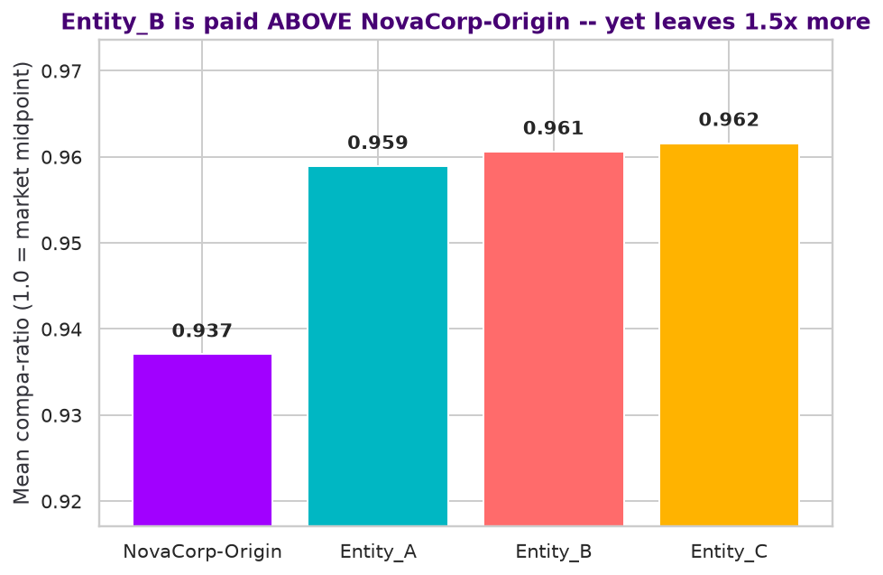

### 14. A likely mechanism: Entity_B's Senior Manager layer is itself leaving at ~3x Entity_A's rate
**In plain English.** Having found that Entity_B's people have lost trust in senior leadership, the obvious next question is whether Entity_B's own leaders are leaving -- which would mean staff are repeatedly watching the layer above them walk out. We tested attrition rates level by level, Entity_A vs Entity_B.

**What the data shows.** At Level 3 (Senior Manager), Entity_A loses 6.7% while Entity_B loses 18.0% -- roughly a 3x difference on matched sample sizes (n=150 vs n=150), and statistically significant (p=0.0050). Across all of Level 3 and above, Entity_B runs 14.8% against Entity_A's 6.2%. Notably, at Level 5 and above no acquired-entity leaders departed at all in the window -- so this is specifically the Senior Manager tier, the leadership layer closest to frontline staff, rather than the executive tier.

**So what.** This offers a plausible, evidence-based explanation for the collapse in senior-leadership trust and purpose: Entity_B staff are watching their most visible leadership layer disappear, which is exactly the group that would normally communicate what the integration means and hold the sense of mission together. It also suggests the intervention has to start by stabilising the Entity_B Senior Manager population itself -- retaining and re-equipping that layer -- before any broader communication effort will land, since there would otherwise be nobody credible left to deliver it.

**Where this comes from.** `employees.csv` only -- fields role_level, legacy_entity_code, status, manager_id. Test: chi-square test of independence per role level.

**Caveat.** This is an association, not proof of cause. The data cannot establish direction: departing Senior Managers may be eroding staff trust, or the same underlying integration problem may be independently driving both. Note also that the share of staff whose own direct manager departed is only marginally higher in Entity_B (1.1% vs 0.9%), so the effect is unlikely to be simply 'my personal boss left' -- it is more consistent with visible churn in the leadership tier as a whole.

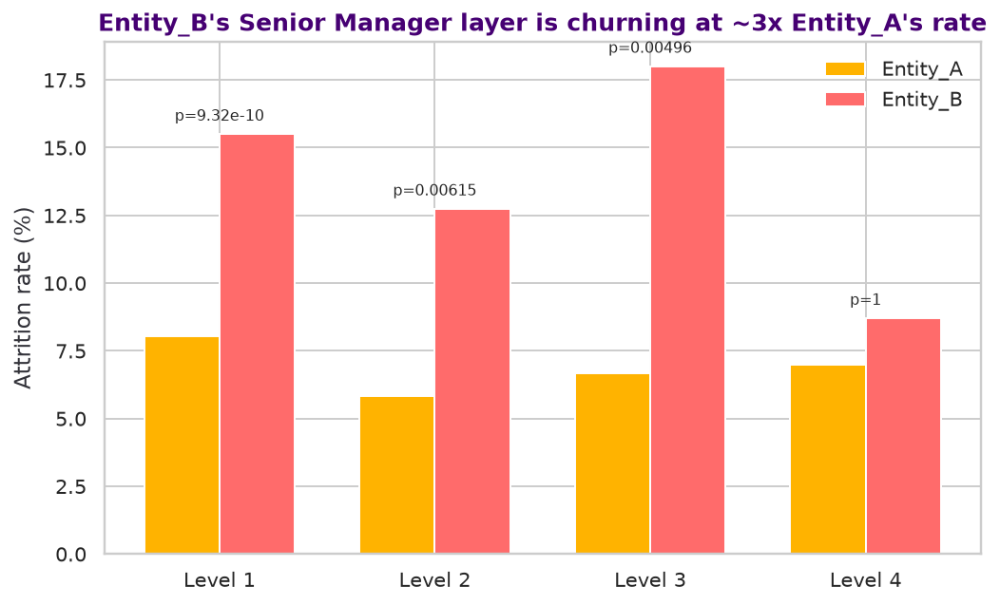

### 15. The precise diagnosis: Entity_B's managers are fine -- its people have stopped believing in NovaCorp
**In plain English.** Every previous comparison used the composite engagement index -- the average of all eight survey dimensions. Averaging can hide a lot: two dimensions collapsing can be cancelled out by six healthy ones. So we broke the composite apart and tested Entity_A against Entity_B on each of the eight dimensions separately, averaging each person's scores across waves first so that nobody is counted more than once.

**What the data shows.** Six of eight dimensions show no meaningful gap -- including, critically, **manager effectiveness** (Entity_A 3.344 vs Entity_B 3.371, p=0.35 -- no difference) and **psychological safety** (3.351 vs 3.354, p=0.91 -- no difference). Two dimensions collapse: **senior leadership trust** (3.352 vs 3.051, a gap of -0.301, p=1.5e-25) and **purpose & meaning** (3.358 vs 3.058, gap -0.300, p=2.6e-25). The composite index shows only 3.366 vs 3.280 -- a gap of -0.085, which looks like nothing. That is the two collapsed dimensions being diluted by six healthy ones. The gap is consistent across every survey wave (not one bad quarter) and holds among currently-active staff alone (p=4.6e-25), so it is not an artifact of leavers dragging the average down.

**So what.** This changes the recommendation. A generic 'manager capability uplift' would be the wrong intervention for Entity_B -- their direct managers and team environments are measurably fine. What has broken is their trust in NovaCorp's senior leadership and their sense of purpose in the merged organisation: the signature of an acquisition where people never bought into the acquirer. The intervention is senior-leadership visibility, honest communication about what integration means for them personally, and re-establishing purpose -- not manager training. It also explains the silence: people who have stopped trusting senior leadership stop answering senior leadership's survey, which is exactly why Entity_B's response rate has fallen 21 points while its manager scores look normal.

**Where this comes from.** `engagement.csv` (response_flag == True rows only; all 8 dimension columns) joined to `employees.csv` (legacy_entity_code, status). Scores are averaged per employee across waves BEFORE comparing, so no person is counted more than once. Test: Welch's t-test per dimension. n = 1,938 Entity_A vs 1,697 Entity_B employees.

**Caveat.** This is measured only among Entity_B people who still respond to the survey (62.6% of them). If the non-responders are more disaffected than the responders -- which the attrition data suggests is likely -- the true gap is probably larger than measured here, not smaller. Note also that the survey shows WHAT is broken, not WHY: the datasets contain no record of which integration activities were actually performed at each entity, so we cannot attribute the difference to any specific programme Entity_A ran and Entity_B did not.

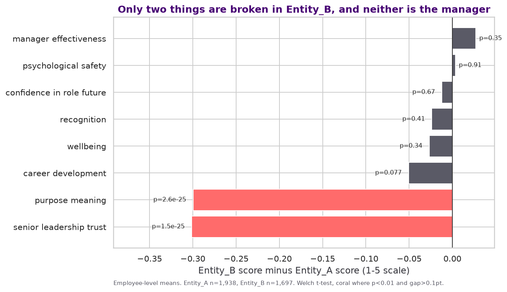

### 16. Entity_B did not slowly lose faith -- it arrived broken, on day one, and stayed that way
**In plain English.** We wanted to know WHEN the damage happened. Did Entity_B's people gradually lose faith over the 18 months after being acquired, or did they arrive already feeling this way? The survey runs in five waves over two years, and each acquired group appears in the data from the first wave after it joined -- so we can watch each group's scores from the moment they arrive. This matters enormously for what you do about it: a gradual slide and a day-one shock need completely different responses.

**What the data shows.** Entity_B first appears in wave 2. Its purpose score at that very first measurement is already 2.975, and its trust score 3.060 -- both far below NovaCorp-Origin's steady 3.38. Three waves and roughly a year later it sits at 3.067: essentially flat. It never declined, because there was never a healthy starting point to decline from. Entity_C shows the same pattern on arrival (3.205 on purpose) though less severely. Entity_A, measured well over a year after its own integration completed, sits at a normal 3.365 throughout.

**So what.** Two things follow, and both change the recommendation. First, any early-warning system built to spot a DECLINE will never catch this -- there is no decline to spot. The signal is the level on arrival, so acquired groups need to be measured against the company baseline from their first survey onward, not against their own trend. Second, the damage is being done at or before the moment of acquisition -- in how the deal is explained and how people are brought across -- not gradually through poor management afterwards. That means the fix for Entity_C and for any future acquisition is front-loaded: get the arrival right, because you are not going to fix it later by trend-watching. Entity_A proves recovery is possible, but it took full integration to get there.

**Where this comes from.** `engagement.csv` (response_flag == True; purpose_meaning and senior_leadership_trust columns, averaged per wave per entity) joined to `employees.csv` (legacy_entity_code). Wave dates confirm timing: wave 1 Feb 2024 through wave 5 Jul-Aug 2025.

**Caveat.** Entity_B has no pre-acquisition survey data, so we cannot see whether these people already felt this way at their old company before NovaCorp acquired them -- an important alternative explanation we genuinely cannot rule out with this data. Entity_C appears in only one wave so far, so its reading is a single snapshot, not a trend.

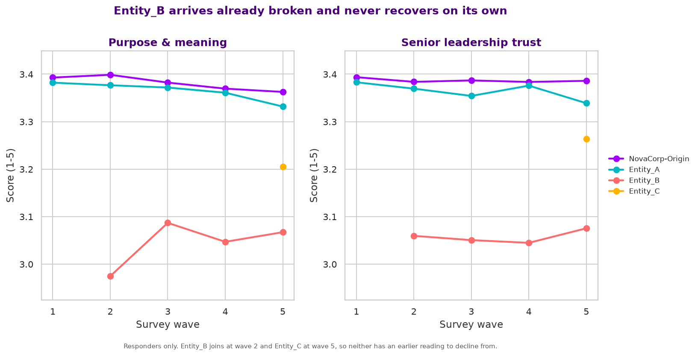

### 17. Inside Entity_B, low purpose scores do NOT reliably separate who leaves from who stays
**In plain English.** It would be convenient if, within Entity_B, the people with the lowest purpose scores were the ones who left -- that would give you a ready-made list of who to help first. We tested it directly, comparing purpose scores of Entity_B people who left against Entity_B people who are still there.

**What the data shows.** Entity_B people who left averaged 2.929 on purpose; those who stayed averaged 3.070. The gap points the expected direction but does not reach statistical significance (p=0.084, above the 0.05 threshold), on 141 leavers against 1556 stayers.

**So what.** This is a genuinely useful negative result, and it sharpens the recommendation. The purpose and trust problem is a CONDITION OF THE WHOLE ENTITY_B COHORT, not a way to rank individuals within it for targeting. So do not build an individual risk score out of these two scores and go chasing the lowest-scoring people. Treat Entity_B as the unit of intervention -- fix the cohort's experience of the integration collectively -- and use survey silence (Part 1's strongest individual-level signal) if you need to prioritise specific people within it.

**Where this comes from.** `engagement.csv` (purpose_meaning, averaged per employee) joined to `employees.csv` (legacy_entity_code, status). Test: Welch's t-test, Entity_B active vs departed.

**Caveat.** Departed Entity_B staff also responded to fewer surveys before leaving, so their average rests on thinner data than stayers'. The true gap could be somewhat larger than measured -- but on the evidence available it is not a dependable individual targeting signal.

## Governance & data integrity

### 18. NovaCorp's published Annual Report appears to mislabel its headline attrition metric
**In plain English.** We cross-checked our own calculations against NovaCorp's published FY2025 Annual Report to make sure we were describing the same workforce. Headcounts matched exactly (12,003 active employees; every department headcount matched to the person). But when we tried to reproduce the column the report labels 'Voluntary Attrition', it did not match our voluntary-exit calculation -- it matched our TOTAL exit calculation instead.

**What the data shows.** Across all seven departments, the Annual Report's stated 'voluntary attrition' matches our all-exits rate to one decimal place, every time (Retail Banking 9.3% vs our 9.3%; Technology 10.4% vs 10.4%; Risk & Compliance 11.8% vs 11.8%, and so on). Our actual voluntary-only rates are consistently ~2 points lower (7.7%, 8.5%, 9.6% respectively). At group level: the report states 10.4% voluntary attrition; our total attrition is 10.4% and our voluntary-only figure is 8.5% (1,133 voluntary exits of 13,403 people on the roster). The published figure appears to include the 267 involuntary exits (redundancies, performance and conduct exits) inside a metric labelled 'voluntary'.

**So what.** This is worth raising with the CHRO directly, for two reasons. First, credibility: this number is published to shareholders and used as a Board-level FY2026 target. Second, and more usefully -- it changes whether NovaCorp is hitting its own target. The Annual Report commits to 'voluntary attrition below 9.5% by FY2026'. On the published (apparently total-attrition) basis, NovaCorp is at 10.4% and missing. On a strict voluntary-only reading, it is already at 8.5% and has met the target. The company may be directing remediation spend at a target it has already hit, while the real problem -- concentrated, involuntary-inclusive churn inside Entity_B -- sits outside how the metric is framed. We recommend the definition be fixed and restated before any FY2026 target is tracked against it.

**Where this comes from.** Our figures: `employees.csv` (status, department) and `attrition_log.csv` (exit_type). Compared against the NovaCorp FY2025 Annual Report, section 06 'Workforce & People' department table and the section 07 FY2026 guidance table.

**Caveat.** We are inferring the definition from an exact numerical match across seven independent departments, which is strong evidence but not a substitute for confirming the intended definition with NovaCorp's HR reporting team. It is also possible the underlying dataset, rather than the report, carries the labelling error -- either way, the two do not currently agree, and that discrepancy needs resolving before the metric is relied upon.

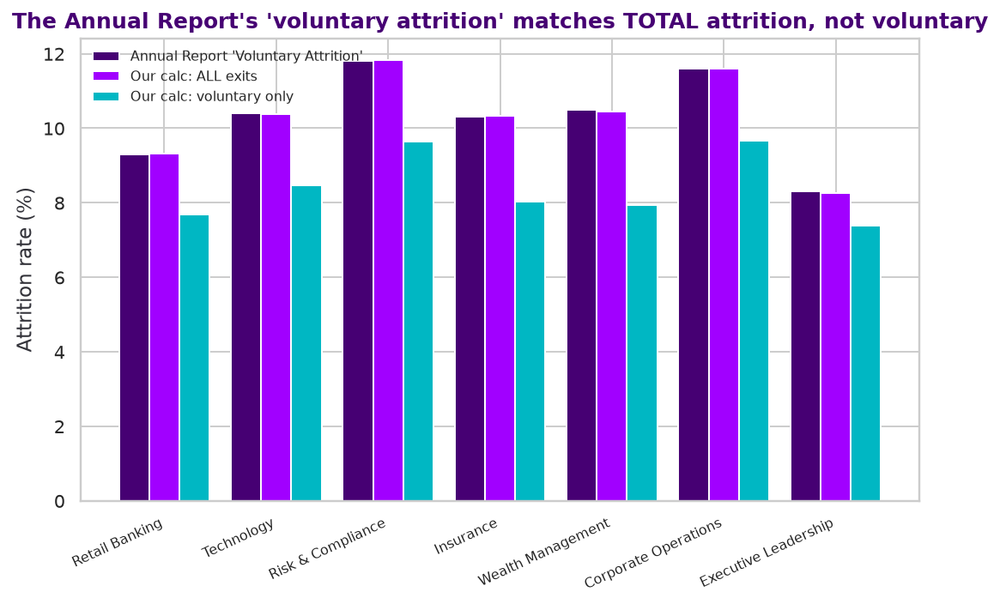
