# NovaCorp — Part 1 (Explore): The Hidden Trends

_Auto-generated by `explore_part1.py`. Every number below is computed from the four raw datasets; figures are in `figures/`._

## The one-sentence story

> NovaCorp isn't losing a talent war — it is **pushing its best people out** (68% 'push' vs 32% poached), the damage is **concentrated in specific acquired entities**, and the earliest warning sign is **behavioural, not attitudinal** (people go *silent* on surveys long before scores drop) — which makes the majority of the $42M **preventable**.

## Ranked findings

### 1. The data itself is the first finding
**What the data shows.** NovaCorp's people data lives in 4 separate HR systems (WorkdayHR, SAP-HR, BambooHR, PeopleSoft) inherited from 4 legacy entities. 2% of staff have never been captured cleanly in a survey wave.

**So what.** You cannot manage what you cannot see as one workforce. A single integrated people-data layer is the precondition for every recommendation that follows.

### 2. It's a self-inflicted wound, not a talent war
**What the data shows.** 68% of exits are 'push' (disengagement-driven), only 32% are 'pull' (poached). 'Career advancement' is the #1 stated reason. And 37% of leavers (523 people) are High Performers or Outstanding.

**So what.** The dominant lever is internal (engagement, managers, growth) — not compensation to fight poachers. That reframes the entire business case toward *preventable* attrition.

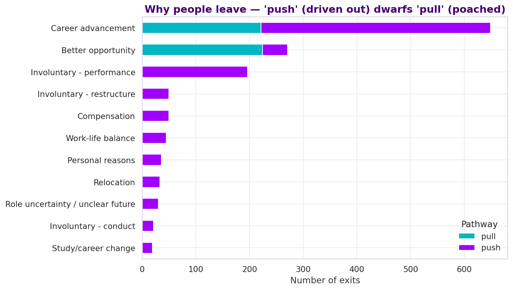

### 3. The acquisitions never fully integrated
**What the data shows.** Attrition ranges from 3.6% to 7.0% a year across legacy entities — a 1.9x spread between otherwise-similar populations (composite engagement differs by <0.1 pt). 'Entity_B' loses people at 1.5x the company average, and it sits on a separate legacy HR system (BambooHR-EntityB) — the signature of an acquisition bolted on but never operationally integrated.

*Rates are annualised voluntary exits over active headcount. An earlier version quoted 7.5% to 15.0%, which was total exits including involuntary over the full roster. Restated 14 Aug for consistency with A6 and A14.*

**So what.** Target retention & integration spend at the specific acquired entity rather than spreading it thin company-wide.

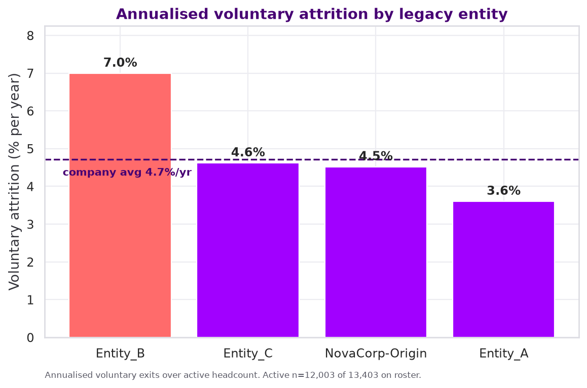

### 4. Survey SCORES are a lagging signal — don't rely on them to catch flight risk
**What the data shows.** On the composite index, leavers (~3.32) sit only ~0.04 pts below stayers (3.35), and the pre-exit slide is small (~0.03 pts over the final year). The dimensions that dip first are 'senior leadership trust' and purpose/meaning — but by <0.1 pt each.

**So what.** The score barely moves before people quit, so a raw engagement threshold will miss most leavers. The usable early warning is behavioural — who STOPS responding (see the non-response finding) — not the attitude score itself.

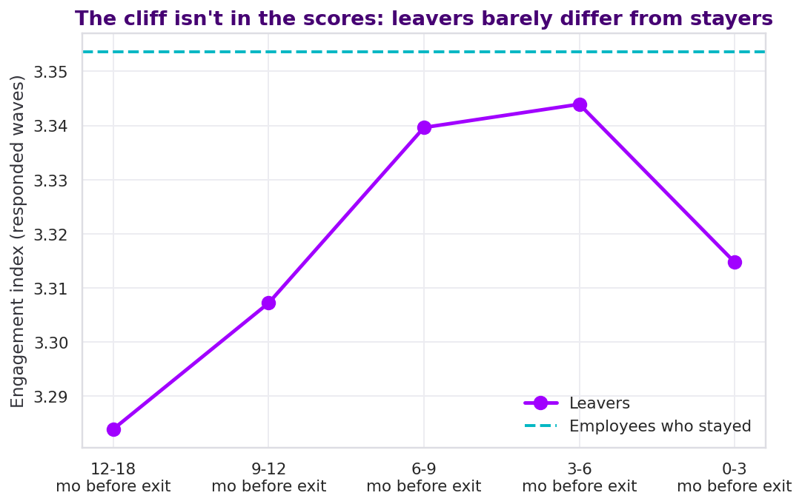

### 5. THE standout signal: silence predicts exit better than any survey score
**What the data shows.** Employees in the lowest survey-response band leave at 30.6% versus 5.2% for consistent responders — a ~6x spread, and a far sharper separator than the engagement scores themselves. Leavers also respond 15 pts less overall, with the gap widening wave over wave.

**So what.** Non-response is not missing data — it IS the data. A near-free 'going quiet' flag on the survey system NovaCorp already runs is the single highest-leverage early-warning signal available.

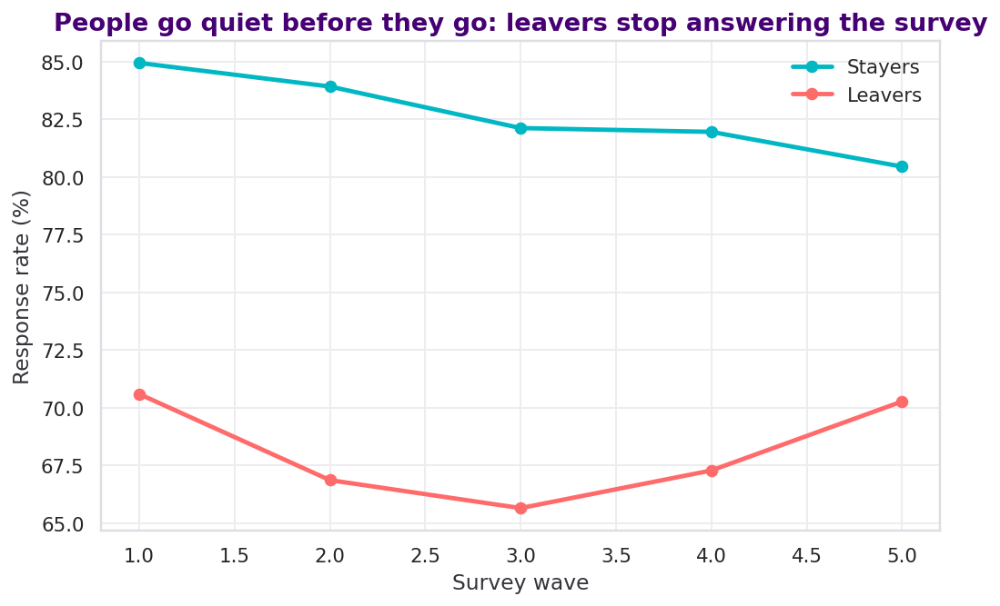

### 6. It isn't a few 'bad managers' — psychological safety is the real fault line
**What the data shows.** Blame is NOT concentrated: the worst 10% of managers hold only 18% of exits, it takes 916 of 1,196 managers to reach 80%, and just 19 managers have 3+ exits. What DOES separate high- from low-attrition teams is team psychological safety.

**So what.** The lever is a broad manager-capability / psychological-safety uplift, not firing a handful of outliers — and it can be targeted using team psych-safety scores NovaCorp already collects.

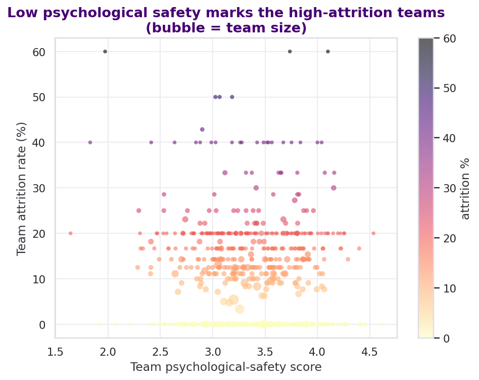

### 7. Under-recognised high performers are a real — if modest — flight risk
**What the data shows.** Employees in the top quartile of goal achievement BUT bottom quartile of recognition (823 people) leave at 9.6% vs 8.1% for everyone else (1.2x), and are 1.7x more likely to be flagged high-potential. (Note: likely understated — departed staff have thinner recent survey coverage.)

**So what.** A structured recognition mechanism is low-cost and targets exactly the high-value population NovaCorp can least afford to lose.

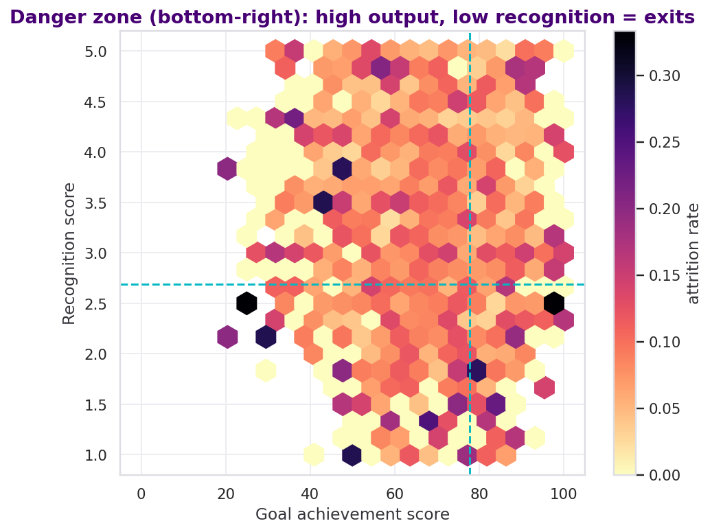

### 8. Pay is NOT the main story — gaps are small where the sample is large
**What the data shows.** Overall, leavers sit only marginally below stayers on compa-ratio (0.94 vs 0.95). Across the high-headcount levels (1-4, thousands of staff each) the Anglo vs other-background gap is <=1.0 pt — effectively negligible. Larger gaps only appear at senior levels 5-7, but those rest on <80 people and are not reliable.

**So what.** Compensation is a minor push factor here, not the lever. Don't lead the business case with pay — but do run a proper equity audit and true-up below-midpoint high performers as a cheap retention hedge.

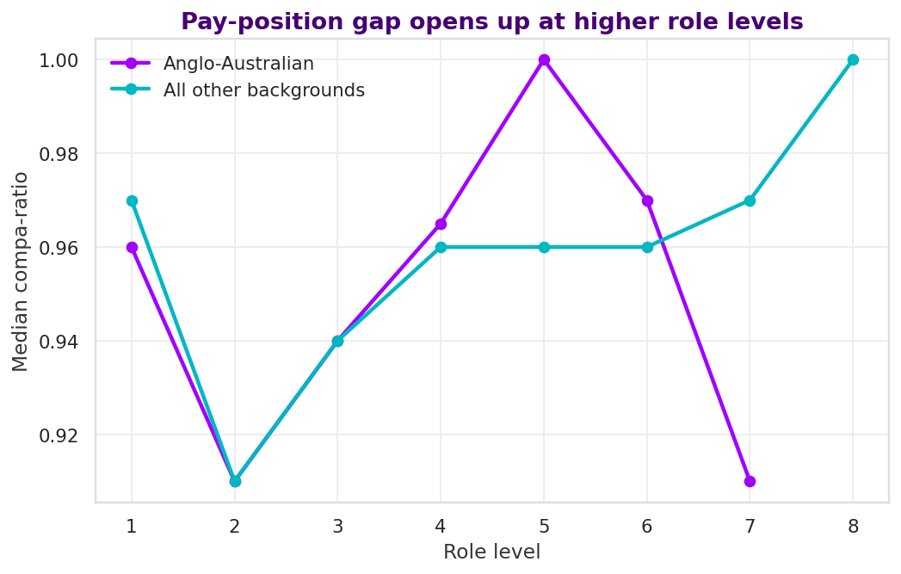

### 9. Seniority barely protects — no 'frozen middle', the pain is company-wide
**What the data shows.** Attrition is a near-constant 10.2-10.7% across role levels 1-4 and only drops at level 5+ (5.1%). There is no isolated 'frozen middle' — the uniformity says the advancement problem is structural, matching 'career advancement' as the #1 stated exit reason across the whole junior-to-mid population.

**So what.** Because the pain is uniform, the fix (career-path clarity, internal mobility) should be a company-wide program rather than a middle-management patch.

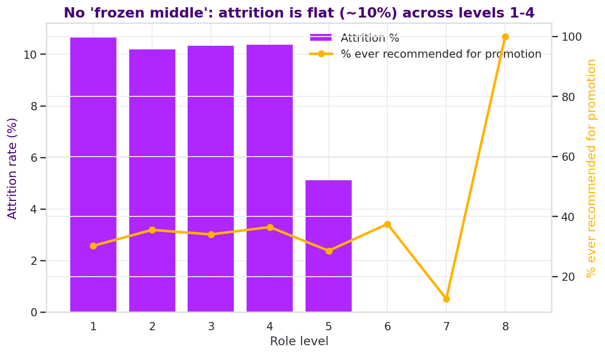

### 10. Retention risk is front-loaded — the first year is decisive
**What the data shows.** 29% of all exits happen within the first 12 months of tenure, and survival curves diverge sharply by hire source and legacy entity within the first two years.

**So what.** Onboarding and early-tenure experience (especially for agency/acquisition hires) is where prevention spend has the highest ROI.

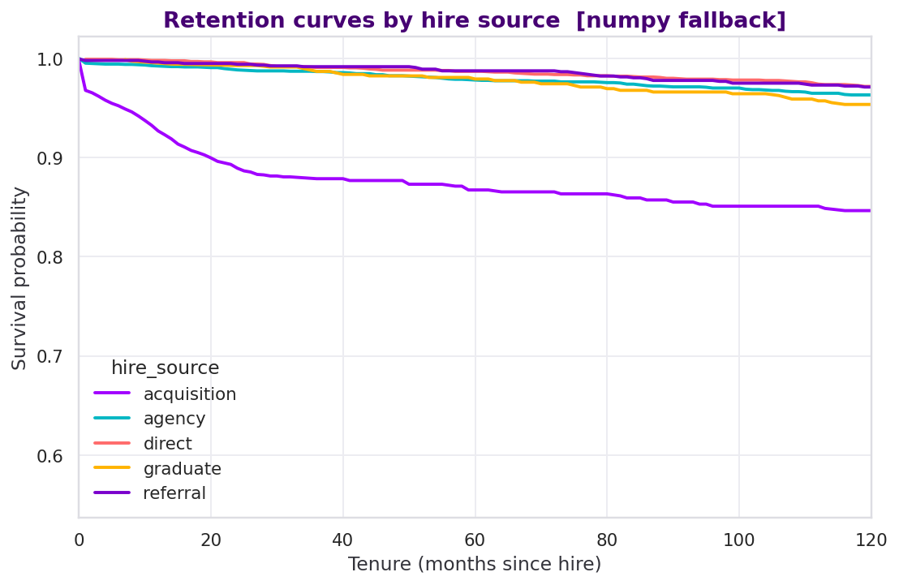

### 11. The strongest predictors are all fixable engagement signals
**What the data shows.** The features most associated with leaving are resp_rate, legacy_entity_code, senior_leadership_trust, hipo_flag — engagement, recognition and manager quality, not immutable demographics. A composite risk score built from these could rank every employee's flight risk today.

**So what.** A lightweight attrition-risk model (using data NovaCorp already collects) turns HR from reactive to predictive — the core of the Part-2/3 recommendation.

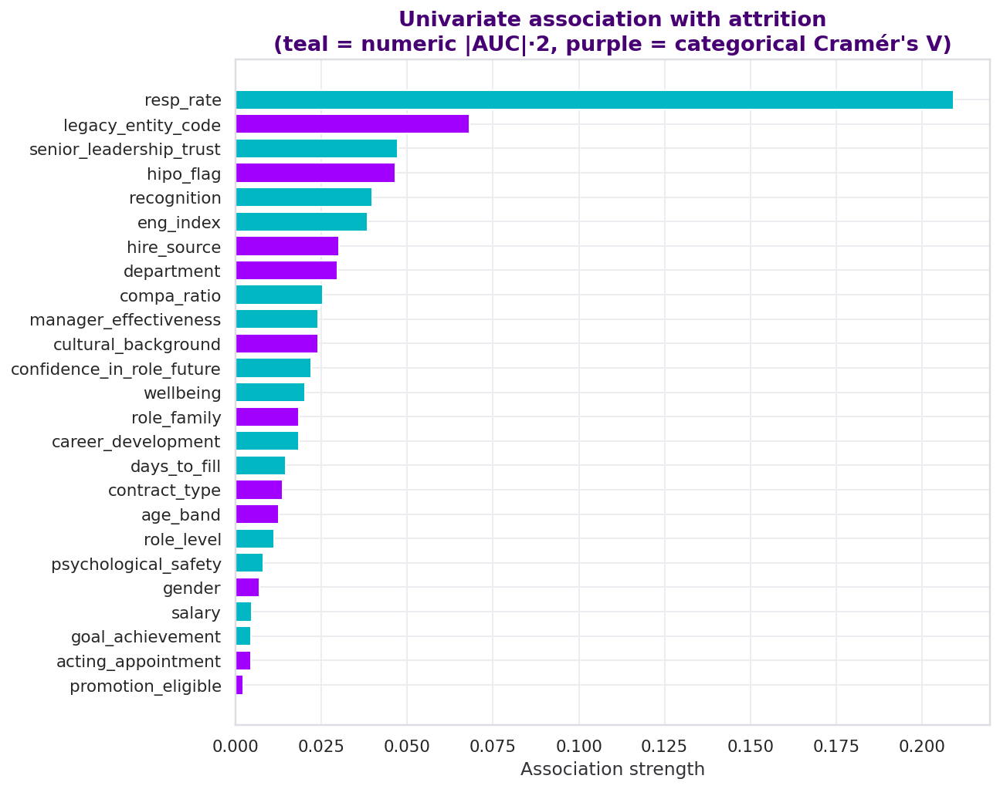

### 12. The majority of the loss is preventable, and we can size it
**What the data shows.** At a conservative 0.5-1.0x-salary replacement cost, ~566 voluntary exits/yr cost $35-70M/yr. Because 68% is 'push', roughly $24-48M/yr is addressable through engagement, manager and recognition levers — squarely inside the stated $42M.

**So what.** Every downstream recommendation can be tied to a defensible dollar figure, which is exactly what a CHRO needs to fund the change.

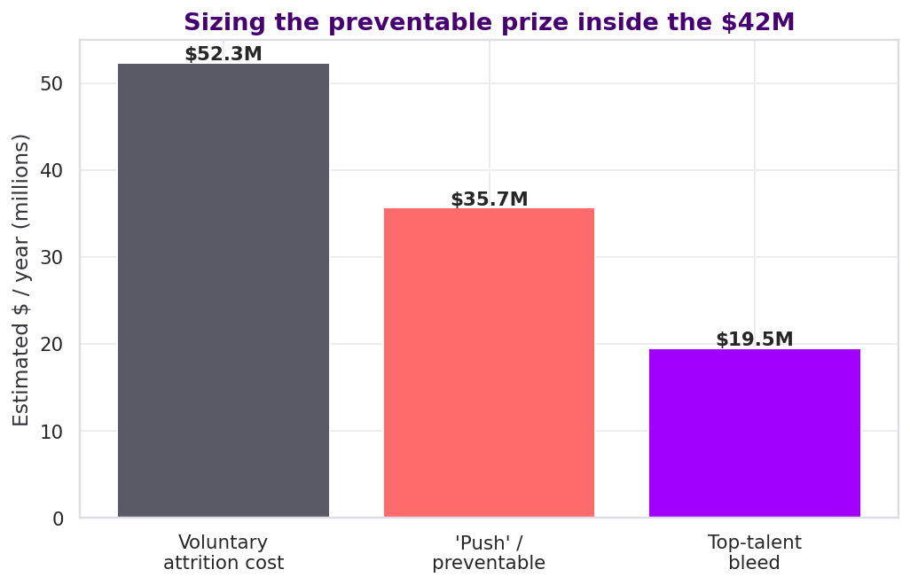

---

### How to read the analysis

- **Push vs pull**: push = disengagement-driven exits; pull = poached by a better offer.

- **Engagement index**: mean of the 8 pulse-survey dimensions, responded waves only.

- **compa-ratio**: salary vs market midpoint for the role (<1.0 = paid below midpoint).

- **Survival curve**: probability an employee is still present at a given tenure.

_Optional libraries detected — scipy: False, scikit-learn: False, lifelines: False. Where absent, numpy fallbacks were used._
